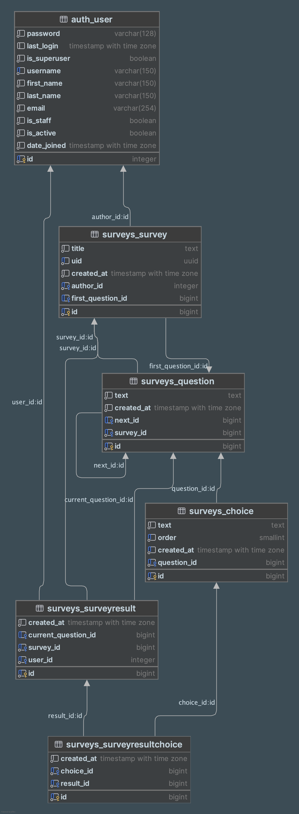

### Тестовый проект опросов

#### Запуск

1. Устанавливаем [Docker](https://docs.docker.com/).
2. Клонируем репозиторий, идем в корневую папку.
3. Запускаем базу:
   ```shell
   docker compose up -d db
   ```
4. Делаем первоначальную настройку:
   ```shell
   docker compose up --build init_db
   docker compose up --build add_test_data
   ```
5. Запускаем сервер:
   ```shell
   docker compose up --build app
   ```
6. Админка доступна по [http://localhost:8000/admin](http://localhost:8000/admin). Входим по имени и паролю `test`.

#### Результат выполнения

1. Схема БД
   
2. Для прохождения опроса открываем в браузере [http://localhost:8000/surveys/1/](http://localhost:8000/surveys/1/).
   Вместо 1 можно подставить любой другой id и пройти другой опрос.

   При первом посещении страниц может понадобиться авторизация, введите имя и пароль `test`.

#### Чего не хватает

Поскольку это тестовое задание, то для экономии времени не было добавлено (хотя в реальном проекте конечно должно быть):

- Автоматические тесты
- В админке на странице редактирования опроса порядок вопросов сверху вниз не отображает реальный порядок вопросов в
  опросе. Несмотря на это возможность задать порядок имеется, важно правильно выставить цепочку вопросов.